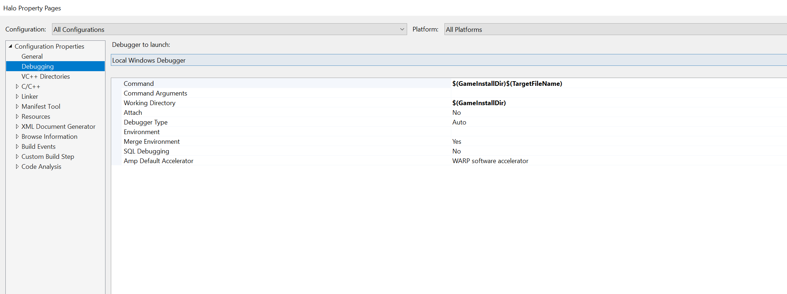

# GameEngineV2
1. Open with Visual Studio 2017
2. Go to Solution Explorer, right click "Halo"
3. Select "Properties", choose "Debugging"
4. Enter $(GameInstallDir)$(TargetFileName) in "Command", enter "$(GameInstallDir)" in "Working Directory"
5. Now you can compile and run

